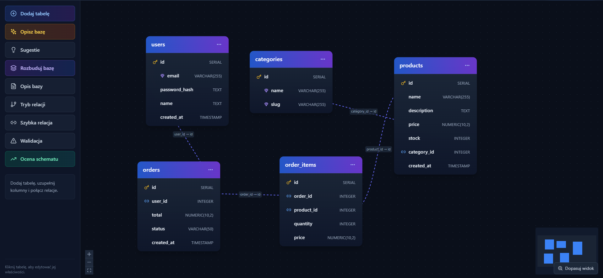

# VisualDB Studio

A local-first visual PostgreSQL schema designer.

[Polska wersja](README.md) | [Open the app](https://milekv.github.io/visualdb-studio/)

[](https://github.com/milekv/visualdb-studio/actions/workflows/ci.yml)




VisualDB Studio lets you design tables and relationships on an interactive canvas, review schema quality, and generate PostgreSQL DDL. It needs no account or backend. Projects stay in browser storage.

## Quick start

1. Open the [live app](https://milekv.github.io/visualdb-studio/).
2. Start from a template or add a table manually.
3. Define columns, a primary key, and relationships.
4. Run validation and review the schema score.
5. Open SQL Preview and download the generated script.

## What it includes

- Interactive React Flow table canvas.
- PostgreSQL columns with PK, FK, UNIQUE, INDEX, NOT NULL, and DEFAULT options.
- Relationships with `ON DELETE` behavior.
- Deterministic relationship suggestions based on column names.
- Checks for missing keys, duplicate names, FK type mismatches, and missing indexes.
- Schema scoring with concrete recommendations.
- Templates and a local rule-based description parser.
- `CREATE TABLE`, constraint, and index generation.
- SQL and project export.
- Automatic project persistence in `localStorage`.

## Real application screenshots

| Home | Schema expansion |
| --- | --- |
|  |  |

| SQL generation | Schema score |
| --- | --- |
|  |  |

## Local development

Node.js 22 is recommended.

```bash
git clone https://github.com/milekv/visualdb-studio.git
cd visualdb-studio
npm ci
npm run dev
```

Quality checks:

```bash
npm run lint
npm run typecheck
npm test
npm run build
```

## Architecture

```text
src/components   canvas, panels, and editing flows
src/lib          SQL generation, validation, scoring, and suggestions
src/store        Zustand project state and browser persistence
src/types        tables, columns, and relationship model
```

All design logic runs in the browser. The app does not upload schema data.

## Current limits

- SQL generation targets PostgreSQL.
- Suggestions are deterministic heuristics and still require human review.
- The app does not connect directly to a production database.

## License

MIT. See [LICENSE](LICENSE).
