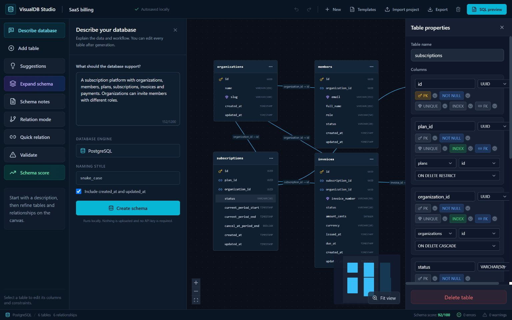
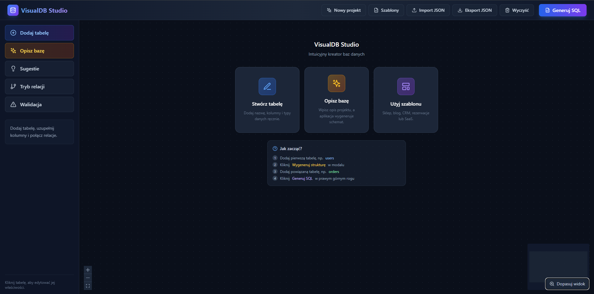
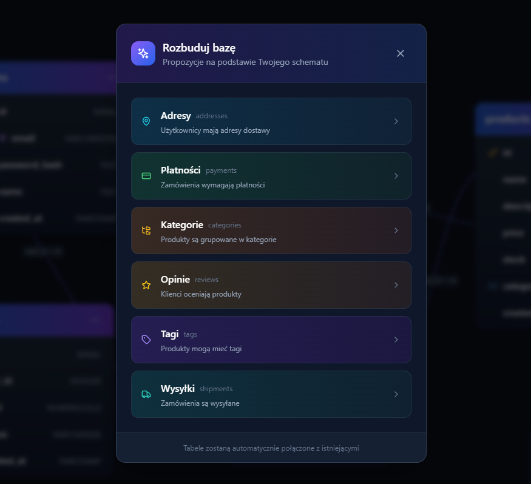
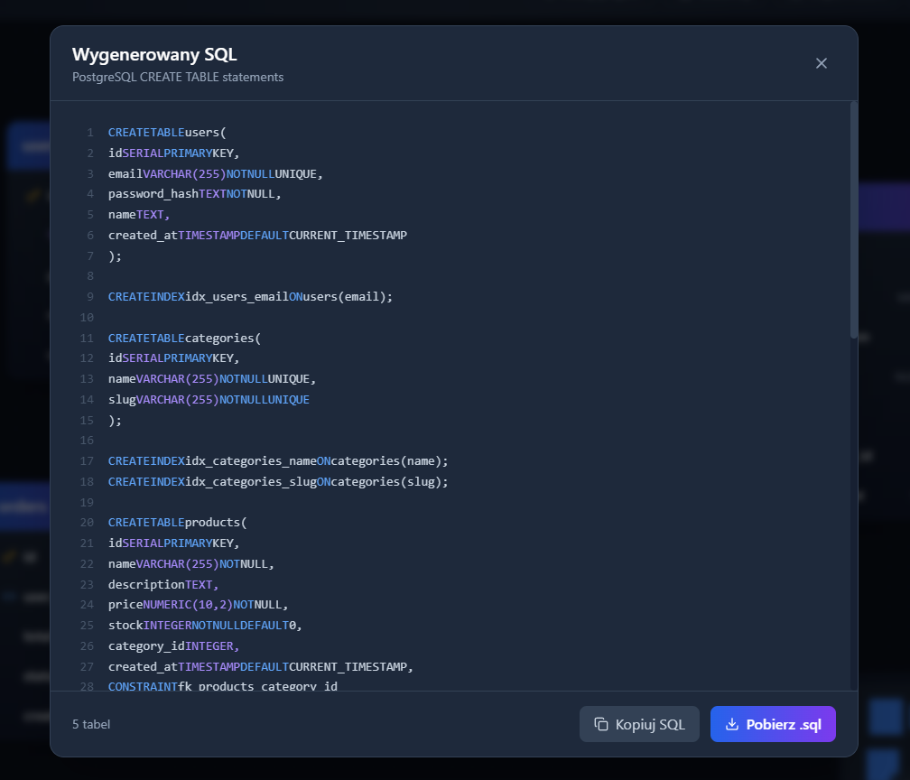
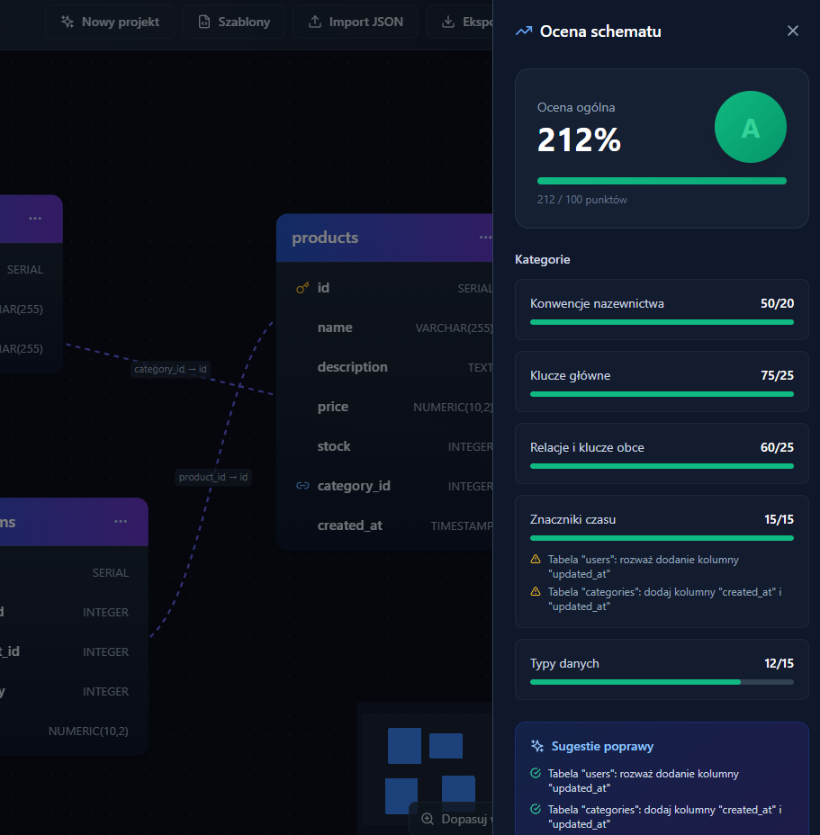

# VisualDB Studio

A local-first visual PostgreSQL schema designer.

[Polska wersja](README.pl.md) | [Open the app](https://milekv.github.io/visualdb-studio/)

[](https://github.com/milekv/visualdb-studio/actions/workflows/ci.yml)




VisualDB Studio lets you design tables and relationships on an interactive canvas, review schema quality, and generate PostgreSQL DDL. It needs no account or backend. Projects stay in browser storage.

## Quick start

1. Open the [live app](https://milekv.github.io/visualdb-studio/).
2. Describe a SaaS, commerce, or booking workflow in plain language, start from a template, or add a table manually.
3. Review the generated tables, foreign keys, indexes, defaults, and design assumptions.
4. Refine columns and relationships, with undo and redo available for local edits.
5. Run validation, review the schema score, and download the generated SQL.

## What it includes

- Interactive React Flow table canvas.
- PostgreSQL columns with PK, FK, UNIQUE, INDEX, NOT NULL, and DEFAULT options.
- Relationships with `ON DELETE` behavior.
- Deterministic relationship suggestions based on column names.
- Checks for missing keys, duplicate names, FK type mismatches, and missing indexes.
- Schema scoring with concrete recommendations.
- A local describe-to-schema planner for SaaS billing, commerce, and booking workflows.
- Explicit design assumptions instead of pretending that a heuristic is certain.
- Undo and redo for schema edits.
- `CREATE TABLE`, constraint, and index generation.
- SQL and project export.
- Automatic project persistence in `localStorage`.

## Real application screenshots

| Home | Schema expansion |
| --- | --- |
|  |  |

| SQL generation | Schema score |
| --- | --- |
|  |  |

## Local development

Node.js 22 is recommended.

```bash
git clone https://github.com/milekv/visualdb-studio.git
cd visualdb-studio
npm ci
npm run dev
```

Quality checks:

```bash
npm run lint
npm run typecheck
npm test
npm run build
```

## Architecture

```text
src/components   canvas, panels, and editing flows
src/lib          SQL generation, validation, scoring, and suggestions
src/store        Zustand project state and browser persistence
src/types        tables, columns, and relationship model
```

All design logic runs in the browser. The app does not upload schema data.

## Current limits

- SQL generation targets PostgreSQL.
- Description planning is deterministic, currently covers three workflow families, and asks for more context instead of returning a fake generic schema.
- Suggestions are deterministic heuristics and still require human review.
- The app does not connect directly to a production database.

## License

MIT. See [LICENSE](LICENSE).
