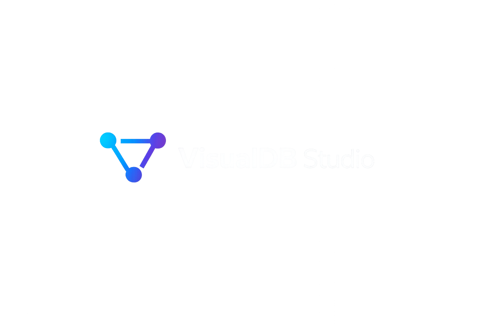

<p align="center">
  
</p>

<p align="center">
  Inteligentny kreator schematów baz danych dla PostgreSQL.
</p>

VisualDB Studio to aplikacja webowa umożliwiająca wizualne projektowanie relacyjnych baz danych oraz generowanie gotowych skryptów SQL dla PostgreSQL.

Projekt został stworzony jako narzędzie ułatwiające modelowanie schematów baz danych, tworzenie relacji między tabelami oraz szybkie przygotowywanie struktur wykorzystywanych w aplikacjach webowych i systemach biznesowych.

<p align="center">
  <a href="https://milekv.github.io/visualdb-studio/">
    
  </a>
</p>

## Najważniejsze funkcjonalności

### Projektowanie schematu bazy danych

* tworzenie tabel na wizualnym canvasie,
* definiowanie kolumn i typów danych,
* obsługa kluczy głównych (PK),
* obsługa kluczy obcych (FK),
* obsługa indeksów,
* obsługa ograniczeń `NOT NULL` oraz `UNIQUE`,
* definiowanie wartości domyślnych.

### Wizualizacja relacji

* tworzenie relacji pomiędzy tabelami,
* wizualne połączenia między kolumnami,
* podgląd zależności w formie diagramu ERD,
* szybkie tworzenie tabel powiązanych.

### Inteligentne wspomaganie projektowania

* automatyczne generowanie typowych struktur tabel,
* wykrywanie potencjalnych kluczy obcych,
* sugestie dotyczące jakości schematu,
* automatyczne propozycje indeksów,
* generowanie opisu bazy danych.

### Generowanie SQL

VisualDB Studio generuje gotowe skrypty PostgreSQL obejmujące:

* CREATE TABLE,
* PRIMARY KEY,
* FOREIGN KEY,
* UNIQUE,
* NOT NULL,
* DEFAULT,
* CREATE INDEX.

## Technologie

Frontend:

* React
* TypeScript
* Vite
* Tailwind CSS

Zarządzanie stanem:

* Zustand

Canvas i wizualizacja:

* React Flow

Animacje:

* Framer Motion

Ikony:

* Lucide React

## Uruchomienie projektu

Pobranie repozytorium:

```bash
git clone https://github.com/milekv/visualdb-studio.git
```

Instalacja zależności:

```bash
npm install
```

Uruchomienie środowiska developerskiego:

```bash
npm run dev
```

Budowa wersji produkcyjnej:

```bash
npm run build
```

## Struktura projektu

```text
src
├── components
├── lib
├── store
├── types
└── App.tsx
```

Najważniejsze moduły:

* sqlGenerator.ts
* schemaValidator.ts
* relationDetector.ts
* smartSuggestions.ts
* descriptionParser.ts
* schemaScore.ts

## Kierunki dalszego rozwoju

Planowane funkcjonalności:

* import istniejących skryptów SQL,
* generowanie diagramu na podstawie SQL,
* obsługa MySQL,
* obsługa SQLite,
* eksport do PNG i PDF,
* zapisywanie projektów w chmurze,
* współdzielenie projektów za pomocą linków.

## Autor

Miłosz Kordziński

GitHub: https://github.com/milekv
